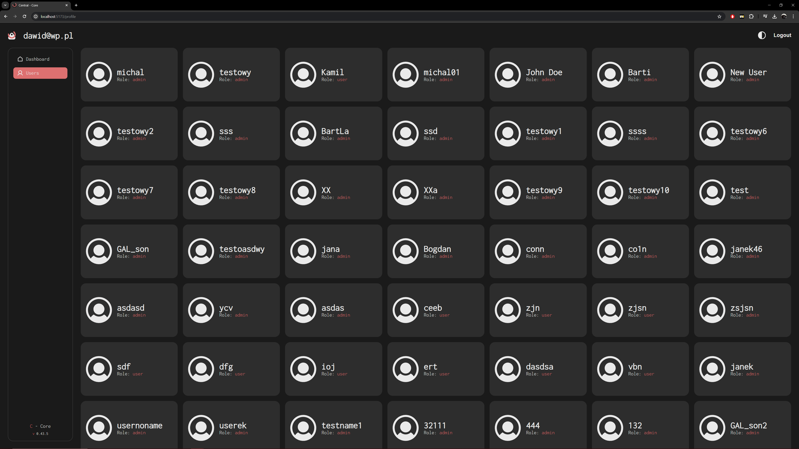

# Central - Core

<p align="center">
  
</p>

React application made with TypeScript utilizing [Vite](https://vitejs.dev) build tool. A web app designed for home needs, featuring a user-friendly dashboard that allows device data monitoring and user managment. Powered by a custom Node.js server.

# Getting Started

> [!NOTE]
> Make sure you have [Node.js](https://nodejs.org/en) and either [npm](https://www.npmjs.com/) or [yarn](https://yarnpkg.com/) package manager installed on your machine before proceeding.

## Step 1: Instalation:

1. **Clone the repository to your local machine:**
```bash
git clone https://github.com/EagleBlood/C-Core.git
```

2. **Navigate to the project directory:**
```bash
cd C-Core
```
> [!IMPORTANT]
> The `api` folder within the main directory contains the backend server, which is essential for the dashboard's functionality.

3. **Installing dependencies:**
There are two sets of dependencies to manage for this project:
- **`/C-Core` Dependencies:** Navigate to the `/C-Core` directory and install dependencies using your preferred package manager.
- **`/C-Core/api` Dependencies:** Move to the `/C-Core/api` directory and install its separate dependencies using the same package manager you used for the core project.

```bash
# using npm
npm install

# OR using Yarn
yarn install
```

## Step 2: Start your Application

Once the installation is complete, you can start the dashboard:

- **Frontend:** In the main project directory (`/C-Core`), to initiate the development server for the user interface, run `npm run dev`
- **Backend:** Navigate to the api subfolder (`/C-Core/api`) and to start the Node.js server handling backend functionality, run `npm run watch`

```bash
# For /C-Core
npm run dev

# For /C-Core/api
npm run watch
```

## Step 3: Fill DataBase informations

In the `api/lib/config.ts` file, you need to provide your existing database information.
```ts
export const config = {
    // other config...
    databaseUrl: process.env.MONGODB_URI || 'your_database_url',
    JwtSecret: "your_jwt_secret"
};
```

Replace `your_database_url` and `your_jwt_secret` with your actual MongoDB URI and JWT secret.

# Functionality

Upon launching the app, it will automatically check if you're logged in and if your access token is valid. If neither of these conditions is met, you will be redirected to the login screen.

> [!IMPORTANT]
>  If server isn't started empty dashboard will be loaded instead. App won't be able to show any information until the server is up and running.

<p align="center">
  
</p>

If the user doesn't have an account yet, one can be created.

<p align="center">
  
</p>

A successful login grants full access to the dashboard functionality. Here, you can view, manage, and control all your connected devices in one place. Bookmarks for eazy device managment can be picked in the apps menu. To personalize your experience, you can change the app theme by clicking the icon next to the `Logout` button.

<p align="center">
  
</p>

Clicking on listed devices will expand detailed information about picked divice. The chart displays historical data for the selected device. Thanks to the xxx plugin, you can freely move and zoom the chart for in-depth data analysis.

<p align="center">
  
</p>

By clicking on plus icon in listed devices, popup with adding new device will appear.

> [!WARNING]
>  Adding device functionality hasn't been added yet and `Add Device` option currently does nothing.

<p align="center">
  
</p>

The `Users` menu provides a comprehensive view of all user accounts within the database, allowing for management tasks.

<p align="center">
  
</p>

Clicking on a user profile opens a window for editing their informations.

> [!WARNING]
>  Functionality for editing and removing profiles isn't implemented yet.

<p align="center">
  
</p>

# How it works

By starting an app, Node.js server instance on port `::5173` will open that will be making HTTP requests to `/api` backend server running on port `::3100`. 

## Data

All devices, along with their details, are stored in a MongoDB cluster. This data is managed through the DataService class in `api/lib/modules/services/data.service.ts`, which provides methods for creating, querying, and deleting device data. The `DataController` class in `api/lib/controllers/data.controller.ts` uses these services to handle HTTP requests related to device data.

User profile data is also stored in the MongoDB. The user data can be accessed and manipulated through the `UserService` class in `api/lib/modules/services/user.service.ts`, and the corresponding `UserController` class in `api/lib/controllers/user.controller.ts`

Connection to the cluster is established in the `App` class in `api/lib/app.ts`, specifically in the `connectToDatabase` method. This method handles the connection setup and also connection errors and disconnections.

The data is then used throughout the application, including in the frontend components.

## User Auth

User authentication is handled using [JWT](https://jwt.io/) library Upon app launch, the locally stored token is checked for its presence and expiration date.

The JWT token is created in the `TokenService.create` method in the `token.service.ts` file. This method takes a user object as an argument, creates a payload with the user's information, and then signs it with a secret key to create the JWT token. The token is then saved in the database with the user's ID, the type of token, its value, and the creation date.

The token is sent to the client and stored locally. Each time a request is made to the server, the token is sent in the headers of the request. The auth middleware in the `auth.middleware.ts` file then verifies the token. If the token is valid and not expired, the request is allowed to proceed. If the token is invalid or expired, an error message is sent back to the client.

The JWT payload, defined in the JwtPayload interface in the `JwtPayloadContext.tsx` file, includes the user's `ID`, `name`, and the expiration timestamp of the `token`.

# API endpoints
List of aviable api requests

### For Device Data
| Method   | URL                       | Description                                              |
| -------- | ------------------------- | -------------------------------------------------------- |
| `GET`    | `/api/data/all`           | Retrieve all data.                                       | 
| `GET`    | `/api/data/:id`           | Retrieve all data for a specific device.                 | 
| `GET`    | `/api/data/:id/:index`    | Retrieve data at a specific index for a specific device. | 
| `GET`    | `/api/data/:id/:from/:to` | Retrieve a range of data for a specific device.          | 
| `POST`   | `/api/data/add/:id`       | Add data for a specific device.                          | 
| `DELETE` | `/api/data/delete/:id`    | Delete all data from a specific device.                  |

- `POST` `/api/data/add/:id` - is used to add data for a specific device. It expects a request body containing `temperature`, `pressure`, and `humidity` fields. The `id` in the URL is the device ID.
  
  Request body:
  ```json
  {
    "temperature": 25.5,
    "pressure": 1013,
    "humidity": 50
  }
  ```

### For User Data
| Method   | URL                        | Description                                 |
| -------- | -------------------------- | ------------------------------------------- |
| `GET`    | `/api/user/all`            | Get all the users                           |
| `POST`   | `/api/user/create`         | Create a new user.                          |
| `POST`   | `/api/user/auth`           | Authenticate a user and return a JWT token. |
| `DELETE` | `/api/user/logout/:userId` | Logout a user and remove their session.      |

- `POST` `/api/user/create` - is used to create a new user or update an existing one. It expects a request body containing user data fields such as `username`, `email`, and `password`.

  Request body:
  ```json
  {
    "username": "new_user",
    "email": "new_user@example.com",
    "password": "new_password"
  }
  ```
  
  Example of a successful response:
  ```json
  {
    "username": "new_user",
    "email": "new_user@example.com",
    "_id": "user_id"
  }
  ```
  
  Example of a error response:
  ```json
  {
    "error": "Bad request",
    "value": "User could not be created or updated"
  }
  ```

- `POST` `/api/user/auth` - is used to create a new user or update an existing one. It expects a request body containing user data fields such as `username`, `email`, and `password`.

  Request body:
  ```json
  {
    "login": "user@example.com",
    "password": "user_password"
  }
  ```
  
  Example of a successful response:
  ```json
  {
    "token": "jwt_token"
  }
  ```

  Example of a error response:
  ```json
  {
    "error": "Unauthorized"
  }
  ```

# Dependencies
### Frontend Application
List of libraries:
```json
{
    "@react-spring/parallax": "^9.7.3",
    "@react-spring/web": "^9.7.3",
    "chartjs-plugin-zoom": "^2.0.1",
    "framer-motion": "^11.1.5",
    "jwt-decode": "^4.0.0",
    "react": "^18.2.0",
    "react-chartjs-2": "^5.2.0",
    "react-dom": "^18.2.0",
    "react-router-dom": "^6.22.3",
    "socket.io-client": "^4.7.5",
    "styled-components": "^6.1.8"
  }
```

### Backend Server:
List of libraries:
```json
{
    "bcrypt": "^5.1.1",
    "body-parser": "1.20.1",
    "cors": "^2.8.5",
    "ejs": "3.1.8",
    "express": "4.18.2",
    "graphql": "16.6.0",
    "graphql-request": "5.0.0",
    "joi": "17.12.2",
    "jsonwebtoken": "^9.0.2",
    "mongoose": "8.2.1",
    "morgan": "1.10.0",
    "socket.io": "^4.7.5"
  }
```
