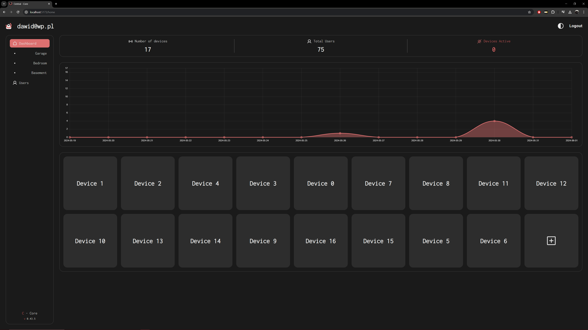
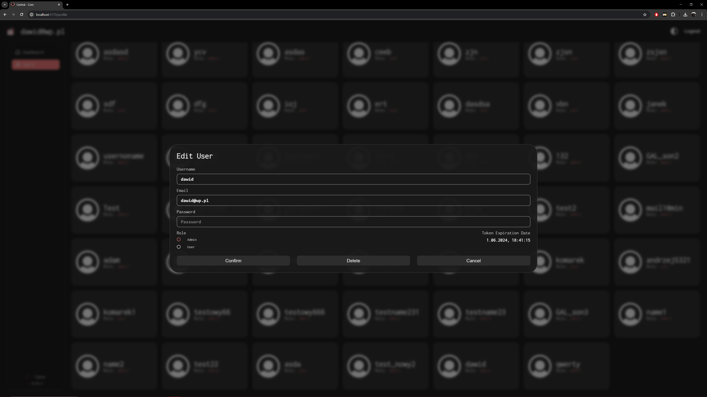

# Central - Core

<p align="center">
  
</p>

React application made with TypeScript utilizing [Vite](https://vitejs.dev) build tool. A web app designed for home needs, featuring a user-friendly dashboard that allows device data monitoring and user managment. Powered by a custom Node.js server.

# Getting Started

> [!NOTE]
> Make sure you have [Node.js](https://nodejs.org/en) and either [npm](https://www.npmjs.com/) or [yarn](https://yarnpkg.com/) package manager installed on your machine before proceeding.

## Step 1: Instalation:

1. **Clone the repository to your local machine:**
```bash
git clone https://github.com/EagleBlood/C-Core.git
```

2. **Navigate to the project directory:**
```bash
cd C-Core
```
> [!IMPORTANT]
> The `api` folder within the main directory contains the backend server, which is essential for the dashboard's functionality.

3. **Installing dependencies:**
There are two sets of dependencies to manage for this project:
- **`/C-Core` Dependencies:** Navigate to the `/C-Core` directory and install dependencies using your preferred package manager.
- **`/C-Core/api` Dependencies:** Move to the `/C-Core/api` directory and install its separate dependencies using the same package manager you used for the core project.

```bash
# using npm
npm install

# OR using Yarn
yarn install
```

## Step 2: Start your Application

Once the installation is complete, you can start the dashboard:

- **Frontend:** In the main project directory (`/C-Core`), to initiate the development server for the user interface, run `npm run dev`
- **Backend:** Navigate to the api subfolder (`/C-Core/api`) and to start the Node.js server handling backend functionality, run `npm run watch`

```bash
# For /C-Core
npm run dev

# For /C-Core/api
npm run watch
```

# Functionality

Upon launching the app, it will automatically check if you're logged in and if your access token is valid. If neither of these conditions is met, you will be redirected to the login screen.

> [!IMPORTANT]
>  If server isn't started empty dashboard will be loaded instead. App won't be able to show any information until the server is up and running.

<p align="center">
  
</p>

If user don't have an account yet, one can be created.

<p align="center">
  
</p>

A successful login grants full access to the dashboard functionality. Here, you can view, manage, and control all your connected devices in one place. Bookmarks for eazy device managment can be picked in the apps menu. To personalize your experience, you can change the app theme by clicking the icon next to the `Logout` button.

<p align="center">
  
</p>

Clicking on listed devices will expand detailed information about picked divice. The chart displays historical data for the selected device. Thanks to the xxx plugin, you can freely move and zoom the chart for in-depth data analysis.

<p align="center">
  
</p>

By clicking on plus icon in listed devices, popup with adding new device will appear.

> [!WARNING]
>  Adding device functionality hasn't been added yet and `Add Device` option currently does nothing.

<p align="center">
  
</p>

The `Users` menu provides a comprehensive view of all user accounts within the database, allowing for management tasks.

<p align="center">
  
</p>

Clicking on a user profile opens a window for editing their informations.

> [!WARNING]
>  Functionality for editing and removing profiles isn't implemented yet.

<p align="center">
  
</p>

# How it works

By starting an app, Node.js server instance on port `::xxxx` will open that will be making http requests to `/api` backend server running on port `::3100`. 

## Data

All devices with thier details are stored in MongoDB cluster. Same applies to user profile data. 

## User Auth

User authentication is done with the [JWT]() library. Upon app launch, the locally stored token is checked for its presence and expiration date.

# API endpoints

...

# Dependencies

...
